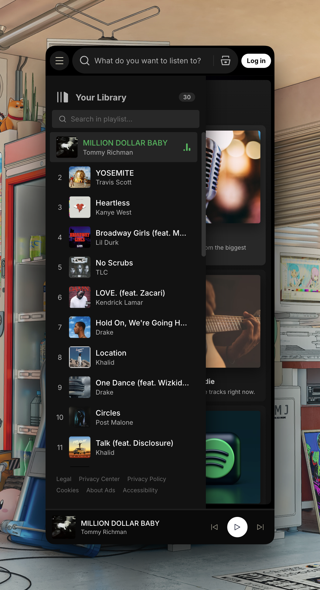

---

# Spotify Clone Audio Engine
> Engineered to deliver an authentic music streaming experience, this dynamic audio engine transforms static UI into an immersive hub for discovering and exploring high-fidelity audio previews across diverse genres.

## 📸 Preview
| Home Page | Mobile Responsive |
|-----------|--------------|
|  |  |

## 🚀 Key Features
- **Dynamic API Integration:** Seamlessly fetches real-time metadata, high-resolution album artwork, and 30-second audio previews using the iTunes Open API without requiring user authentication.
- **Immersive User Experience:** Features a fully custom audio player with interactive controls (play, pause, seek, volume), keyboard shortcut support, real-time equalizer animations, and dynamic ambient background colors based on the active playlist.
- **Advanced State Management:** Implements complex audio engine logic including shuffle algorithms, multi-mode repeat functionality, client-side "Liked Songs" tracking, and real-time search filtering across global playlists and local tracks.

## 🛠 Tech Stack
- **Frontend:** Semantic HTML5, Modern CSS3 (Flexbox/Grid, CSS Variables, Animations), Vanilla JavaScript (ES6+, DOM Manipulation, HTML5 Audio API).
- **Backend/API:** iTunes Open API (RESTful JSON).
- **Tools:** Git, GitHub, VS Code.

## 📦 Installation & Setup
1. **Clone the repo:** `git clone https://github.com/hritikbytes/SpotifyClone.git`
2. **Install dependencies:** `npm install` *(if utilizing any build tools later on, currently pure vanilla setup)*
3. **Run the app:** Open `index.html` in your favorite browser. No build steps are required! Alternatively, use a local server like VS Code Live Server (`npx http-server -p 8000`).

## 💡 Technical Challenges & Learning
One of the primary technical hurdles was engineering a robust, state-driven audio engine using only Vanilla JavaScript and the native HTML5 Audio API. Synchronizing real-time audio playback events (like `timeupdate` and `ended`) with the custom UI seekbar, active track equalizer animations, and shuffle/repeat logic required meticulous state management to avoid race conditions and desynchronization. Furthermore, integrating the iTunes Open API asynchronously while providing instant visual feedback via loaders and toast notifications significantly enhanced my skills in managing asynchronous JavaScript and error handling.

## 🛣 Roadmap
- [ ] Transition from iTunes Open API to the official Spotify Web API for full track playback.
- [ ] Implement user authentication to persist "Liked Songs" and custom playlists.
- [ ] Add Progressive Web App (PWA) support for offline access and native-app feel.
- [ ] Optimize rendering performance for long tracklists using virtual scrolling.

## 🤝 Contact
- **Developer:** Hritik Sharma
- **Links:** [LinkedIn](https://www.linkedin.com/in/hritiksharma0608/) | [GitHub](https://github.com/hritikbytes) | **Email:** hritiksharma.0608@gmail.com

---
