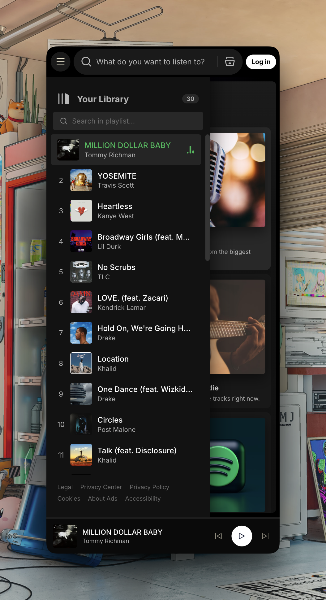

# Spotify Clone

A responsive music player built with vanilla HTML, CSS, and JavaScript.

It uses the iTunes Search API for track information, album artwork, and 30-second previews. No API key or authentication is required.

**Live:** https://spotify-clone-delta-gules.vercel.app/

**Status:** Personal project / deployed demo

## Preview

| Desktop | Mobile |
|:---:|:---:|
|  |  |

## The player

The audio player uses the browser's native `Audio` API rather than a third-party player library.

It supports:

- Play / pause
- Seek and progress tracking
- Previous / next track
- Shuffle
- Repeat all / repeat one
- Volume and mute controls
- Keyboard shortcuts
- Animated equalizer while a track is playing

The player listens to native audio events such as `timeupdate`, `play`, `pause`, and `ended` to keep the UI in sync with playback.

The previous button also restarts the current track when it has been playing for more than three seconds, similar to the behavior users expect from music players.

## Other parts

**Search** filters both playlists and tracks already loaded in the browser.

**Liked songs** are stored in `localStorage`, so they remain available after refreshing the page.

Each playlist has its own ambient background and the currently playing track gets an animated equalizer.

On smaller screens, the two-column desktop layout changes into a navigation drawer with a compact player.

## One small API detail

The iTunes API returns album artwork using smaller image URLs. The app swaps the image size in those URLs when loading artwork so the larger version is used for the player and album views.

## Built with

- HTML5
- CSS3
- Vanilla JavaScript (ES modules)
- HTML5 Audio API
- iTunes Search API
- Vite

## Run locally

    git clone https://github.com/hritikbytes/spotify-clone.git
    cd spotify-clone
    npm install
    npm run dev

For a production build:

    npm run build

Then open the local Vite URL shown in the terminal.

## Note

This is a personal project inspired by Spotify's interface and is not affiliated with or endorsed by Spotify.
